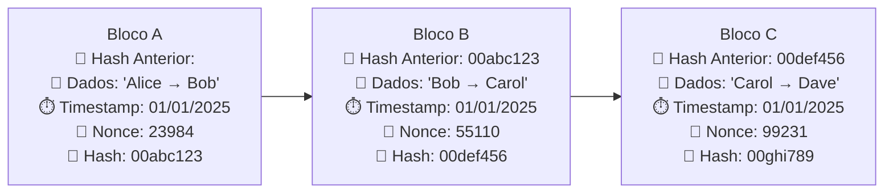
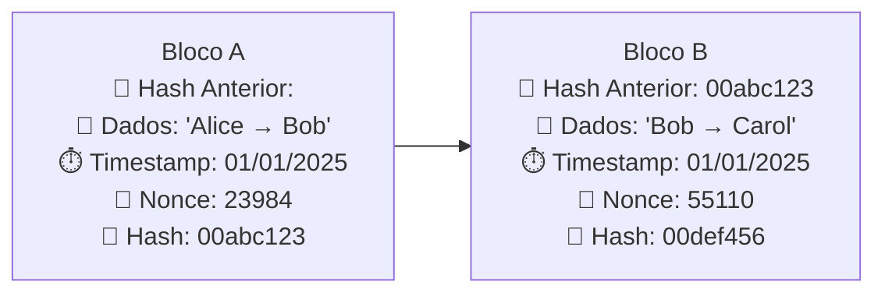
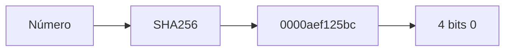
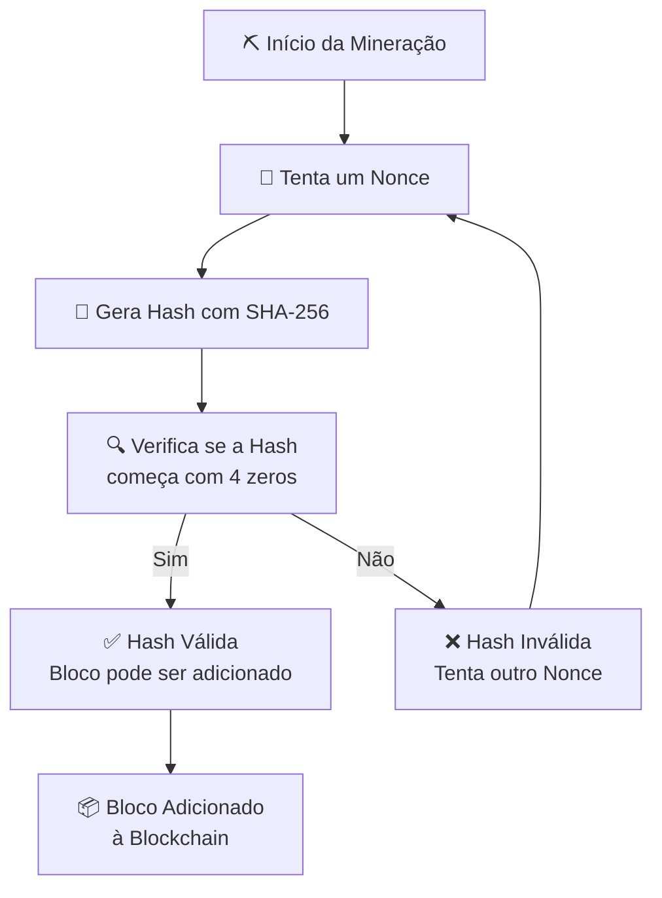
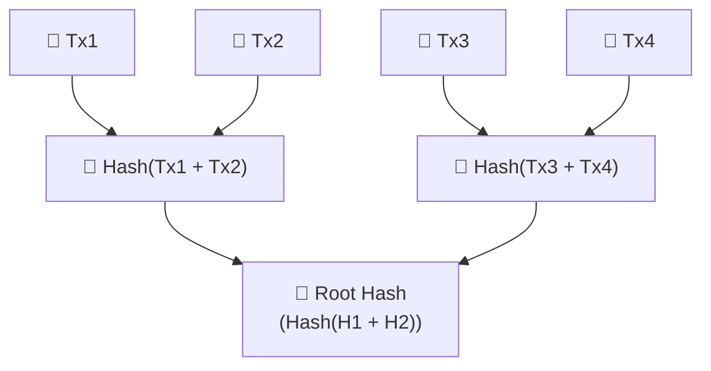
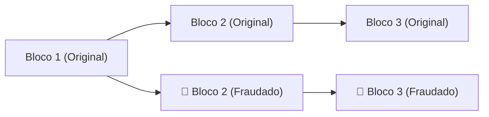

# :chains: O quê é uma **Blockchain**?
Blockchain, ou cadeia de blocos, é uma forma de armazenamento de dados. Assim como armazenamos arquivos em dispositivos como HDs, SSDs ou cartões microSD, na blockchain os dados são armazenados em blocos encadeados.

Cada bloco é conectado ao anterior por meio de um identificador único chamado hash. Sempre que um novo bloco é adicionado, ele armazena também a hash do bloco anterior, formando assim uma cadeia contínua. Se imaginarmos uma sequência de blocos, teríamos algo assim:



A estrutura lembra uma lista ligada, mas com uma diferença fundamental: a necessidade de manter a integridade dos dados. E como fazemos isso? Com criptografia.

## 🔐 Como o hash garante a integridade?
Quando criamos um bloco, a última informação gerada é o seu identificador, ou seja, a hash. Essa hash é calculada aplicando uma função criptográfica sobre todos os dados do bloco (inclusive a hash anterior e o nonce).

Veja um exemplo simples usando o algoritmo SHA-256:
```js
const crypto = require('crypto')
const hash = crypto
    .createHash('sha256')
    .update('Cadeia de dados')
    .digest('hes');

console.log(Buffer.from(hash).toString('hex'));
// 60460d905a8b5eb866797aad256229f1e553f7be0ad3c533420521747ef2b5ac
```
🔁 Uma pequena alteração na entrada gera uma hash completamente diferente:
```js
# SHA256
Entrada: "Cadeia de dados";
Saída: 60460d905a8b5eb866797aad256229f1e553f7be0ad3c533420521747ef2b5ac

Entrada: "cadeia de dados";
Saída: 800098a143bcd7482571a5d28b9f6cb4e3362baeb1c9d2a156dd8ca811bdf80b
```
## 🔎 Sobre algoritmos de hash
Existem diversos algoritmos de hash. O mais famoso no contexto de blockchain é o SHA-256, mas há outros como:
- MD5;
- SHA-1;
- SHA-2;
- SHA-128;
- SHA-256;
- Whirlpool (512 bits).

> 🔍 Whirlpool
> Um algoritmo de 512 bits, desenvolvido por pesquisadores brasileiros e belgas, e que é considerado uma opção de segurança sólida.

Esses algoritmos são unidirecionais, ou seja, não permitem reverter uma hash para descobrir os dados originais. Isso garante a imutabilidade e a integridade dos dados na blockchain.

## 🔁 E se alguém tentar alterar um bloco?

Cada bloco contém uma hash única, que representa o conjunto de informações: dados, timestamp, nonce e hash anterior. Se alguém tentar alterar qualquer informação de um bloco, a hash dele muda — e como o próximo bloco depende da hash anterior, toda a cadeia precisaria ser recalculada.
Veja:



Se o Bloco A for alterado, sua hash será diferente, tornando a hash armazenada no Bloco B inválida. Para manter a cadeia válida, todos os blocos subsequentes teriam que ser alterados — o que exige um enorme poder computacional.

## 📜 História da Blockchain
A blockchain ganhou notoriedade com o boom das criptomoedas, mas suas origens remontam à década de 1970.

🔗 As Origens Criptográficas
Em 1979, o cientista da computação [:link: Ralph Merkle](https://en.wikipedia.org/wiki/Ralph_Merkle) descreveu em sua dissertação uma estrutura que permitia vincular blocos de dados usando funções hash. Essa estrutura ficou conhecida como Árvore de Merkle, e é um dos pilares conceituais das blockchains modernas.

> 💡 Árvore de Merkle: uma estrutura de árvore binária onde cada nó é o hash de seus filhos, permitindo verificar rapidamente a integridade de grandes quantidades de dados.

### 👥 Um Sistema entre Desconfiados
Já em 1982, o criptógrafo [:link: David Chaum](https://en.wikipedia.org/wiki/David_Chaum), considerado o "avô do Bitcoin", apresentou uma dissertação descrevendo um sistema computacional confiável operado por partes que não confiam entre si — uma ideia central da blockchain como a conhecemos hoje.

### 🧱 Primeira Implementação: Bitcoin
A primeira descrição completa de uma blockchain funcional surgiu em 2008, no famoso whitepaper de [:link: Satoshi Nakamoto – "Bitcoin: Um Sistema de Dinheiro Eletrônico Ponto-a-Ponto"](https://bitcoin.org/files/bitcoin-paper/bitcoin_pt.pdf).
Nele, Nakamoto propôs:
- Transações agrupadas em blocos.
- Cada transação com um hash assinado.
- Validação pública das assinaturas.
- Ligação entre blocos por meio de hashes.

Adoção de uma prova de trabalho (Proof of Work - PoW).

#### ⚙️ Como Funciona a Prova de Trabalho?
A PoW exige que o sistema encontre um número que, quando combinado com os dados do bloco e processado por uma função de hash (como SHA-256), gere um resultado que comece com um número pré-definido de zeros.


Quanto mais zeros iniciais forem exigidos, mais difícil é encontrar esse número. Como o hash muda completamente com qualquer alteração nos dados de entrada, a única forma de encontrar o número correto é tentativa e erro.

#### 🔄 O Papel do NOUNCE
O número que satisfaz a condição da PoW é chamado de Nonce (Number used once). Ele:
- É único para cada bloco.
- É incluído no cabeçalho do bloco.
- Não pode ser reaproveitado.

A função de mineração consiste basicamente em tentar diferentes nonces até encontrar um que gere uma hash válida (com os zeros necessários).

#### ⛏️ Mineração: Encontrando o Bloco Válido
Esse processo é chamado de mineração. Quem encontra o nonce correto primeiro "descobre" o bloco e pode propagá-lo para a rede. Como verificar o nonce correto é simples e rápido, qualquer pessoa pode validar o bloco assim que ele for proposto.


## :hammer_and_wrench: Implementação

### 🌳 Árvore de Hash (Merkle Tree)
Em uma blockchain, os dados de transações dentro de um bloco são organizados usando uma estrutura chamada Merkle Tree (ou Árvore de Merkle). Essa estrutura permite:
- Verificar se uma transação pertence a um bloco sem precisar verificar todas as outras.
- Garantir que os dados da transação não foram alterados.
- Otimizar o armazenamento e a verificação de dados.



#### 🛡️ Proteção contra Fraude
A Merkle Tree protege a blockchain da seguinte forma:
- Cada transação é criptografada com uma função de hash.
- As hashes são combinadas duas a duas até chegar à Root Hash, que representa todo o conjunto de transações.
- Se qualquer transação for alterada, a hash da transação muda, afetando todas as hashes subsequentes até a raiz.

#### ⚠️ O que acontece se alguém tentar fraudar?
Se um nó malicioso tentar modificar uma transação dentro do bloco, ele terá que:
- Recalcular a hash da transação.
- Recalcular todas as hashes intermediárias até a Root Hash.
- Criar uma nova cadeia (fork) com base nessa nova árvore de hashes.

Ou seja: ele estaria tentando criar um novo galho na blockchain a partir de uma árvore diferente. Mas para que esse novo galho seja aceito:
- Ele precisaria minerar blocos mais rápido que toda a rede (o que é computacionalmente quase impossível).
- A nova cadeia precisaria se tornar a mais longa para ser considerada válida pelos outros nós.



#### ✅ Resultado
Graças à estrutura em árvore de hashes:
- A integridade de cada transação pode ser verificada individualmente.
- A tentativa de fraude é detectável e praticamente inviável.
> 📚 Essa estrutura foi descrita pela primeira vez por Ralph Merkle em 1979 e é um dos pilares da segurança da blockchain.
